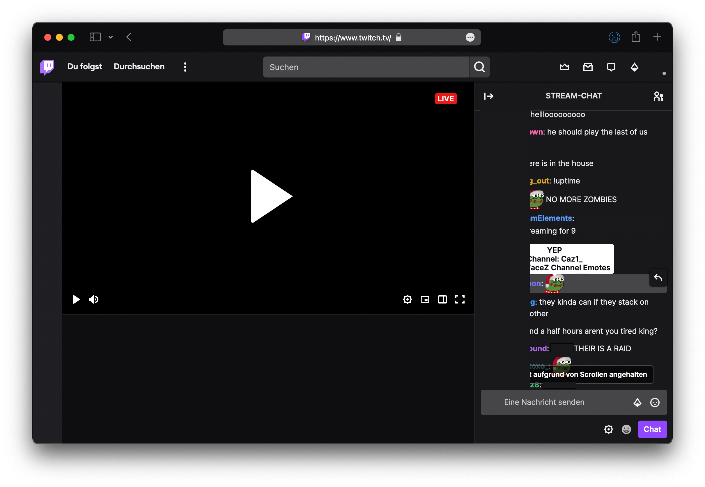

# BTTV for Safari

This unofficial Safari exention adds support for BTTV and FFZ emotes on Twitch. The extension simply injects the BTTV script from the officiale BTTV CDN.

### Download release: 
## Installation

1. Download the app
2. Drag into Applications folder
3. Double click (or right click > Open)
4. Click "Quit and Open Safari Extensions Preferences..."
5. Set checkmark for "BTTV for Safari"
6. Click on "BTTV for Safari", click "Edit webpages". Select "Allow" for twitch.tv.

Everything works, if the `D:` emote in your Safari task bar shines blue when on twitch.tv. Otherwise, click on it and check allow.

